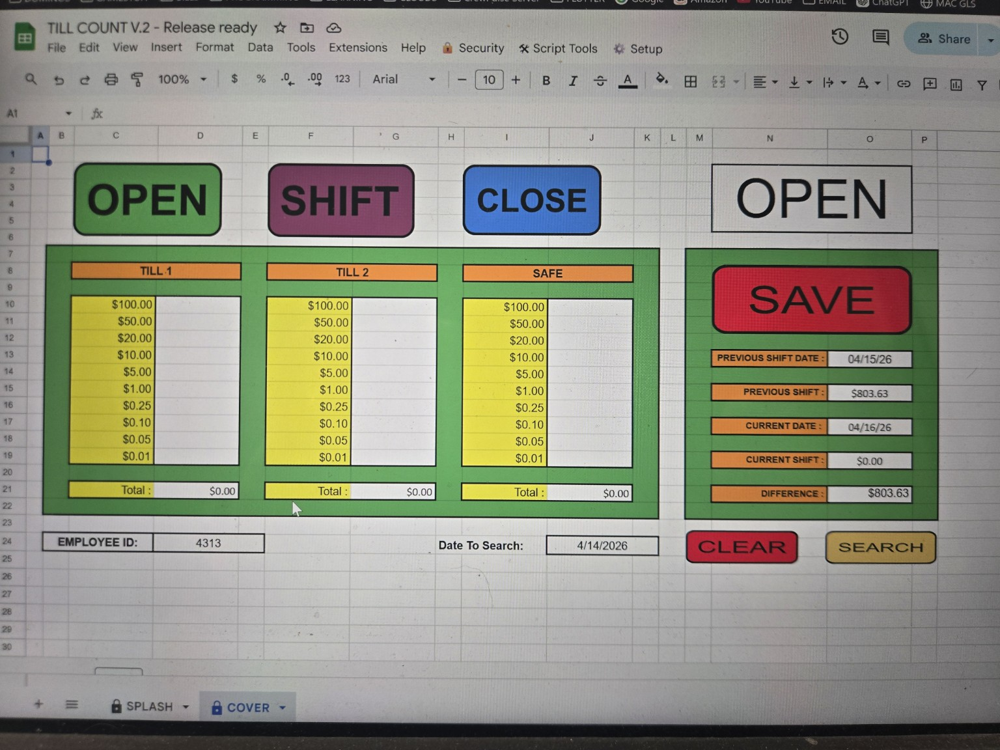
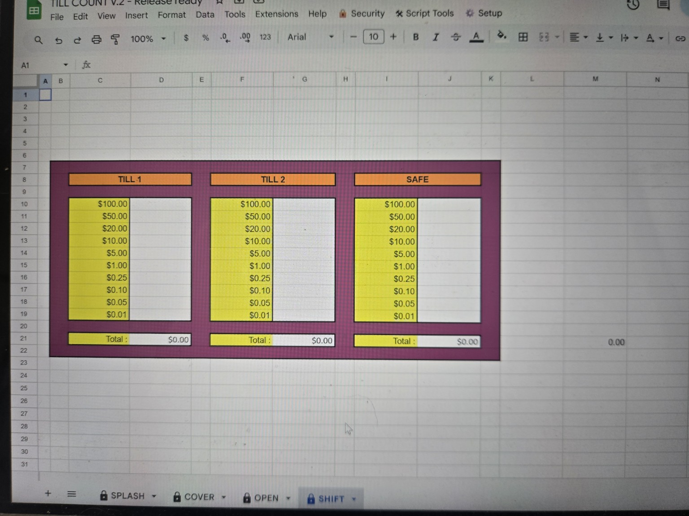
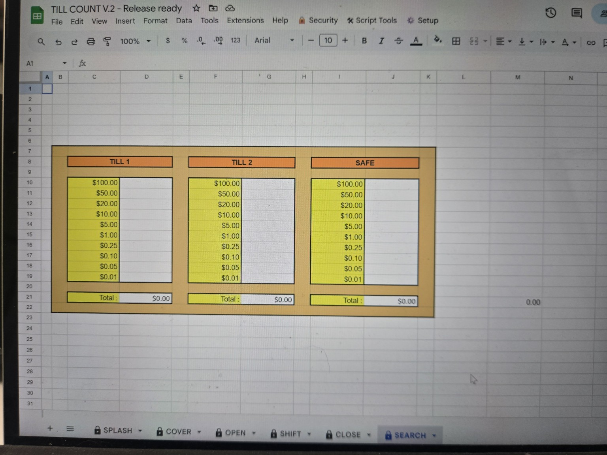

# Crew Till Count System

A real-world cash management and validation tool built for high-volume store operations, reducing manual errors and enforcing structured workflows using Google Sheets + Apps Script.

---

## 🚀 Live Demo
[Open Demo Sheet](https://docs.google.com/spreadsheets/d/1lQgSeNzsheZZIRytQfO_hAeKU-5DRPnEJBk5_HWD7DY/edit?usp=sharing)

*To test functionality: open the sheet and create your own copy.*

---

## 📌 Project Status
Current Version: **v1.0.0**  
Status: **Active development (internal system adapted for public showcase)**

---

## 🔧 Core Capabilities
- Tracks till counts across OPEN, SHIFT, and CLOSE
- Validates all denomination entries before submission
- Stores shift data into structured weekly sheets
- Supports historical lookup via search mode
- Includes overwrite protection for saved submissions

---

## 🛠️ Built With
- Google Apps Script
- Google Sheets

---

## 💡 Why I Built This
Built from real operational experience managing high-volume shifts.

This system enforces structured cash handling, reduces input errors, and creates a reliable historical record of till activity across all shifts.

---

## ⚙️ Key Features
- Locked-sheet protection system
- Live COVER-to-shift synchronization
- Overwrite authorization safeguards
- Automated 4-week calendar system
- Full sheet restoration via script

---

## 🚀 How to Use

1. Open the Google Sheet  
2. Enter values on the COVER sheet  
3. Select active shift (OPEN / SHIFT / CLOSE)  
4. Validate and submit data  
5. Use Search to view historical records  

---

## 📸 Screenshots

---

### Cover Sheet (Main Interface)

Primary interface for entering and managing till data.

---

### Shift Sheets (Live Data)

Holds active shift data synced from the COVER sheet.

---

### Weekly Database (Storage)

Stores submitted data by date and shift.

---

### Search Mode (Historical Lookup)

Allows retrieval of past till data by date.

---

## 📜 Version History

### v1.0.0 — 04.16.2026
- Initial public GitHub release  
- Full till tracking system  
- Validation and overwrite protection  
- Search mode with historical lookup  
- Locked-sheet workflow system  

---

## ⚠️ Notes
- This system depends on a specific spreadsheet structure (sheet names, ranges, and layout).
- Code is provided as a reference implementation of the system logic.
- Demo sheet is a sanitized version with no real store data.

---

## 📫 Contact

📧 [Email Me](mailto:michael.e.freese.tech@gmail.com)

Open to feedback, collaboration, and opportunities.
